Inferential Statistics with the GSS dataset
================
Mobin Piracha
11/29/2020

## Setup

### Load Packages

``` r
library(tidyverse)
```

    ## Warning: package 'tidyr' was built under R version 4.0.3

    ## Warning: package 'readr' was built under R version 4.0.3

``` r
library(statsr)
library(ggthemes)
```

### Load Data

``` r
load("gss.Rdata")
```

-----

## Part I: Data

The General Social Survey has been used to monitor change and studying
the growing complexity of American society since 1972. It is used to
analyze data on contemporary American society to explain trends in
attitudes, behaviors and functioning of American society. The GSS
surveys U.S households using proportional survey technique. We use this
technique because the population is composed of various subgroups and
therefore, the survey samples according to the different subgroups, that
all add up to make up the sample. The sample is drawn using an area
probability design that randomly selects respondents across the United
States to take part in the survey. The sample includes in person and
telephone interviews. Therefore, the GSS uses random sampling and
therefore the results of the survey as generalizable. Since there is no
random assignment, the survey results are not causal. Therefore, the
survey is generalizable to the larger population but not causal.

-----

## Part II: Research question

#### Exploratory Data Analysis

#### Research Question 1:

#### (i) How has religious representation in the sample changed from 1973 to 2012. Create a line graph to show change overtime, and create a stacked barplot to show the change in each decade from 1973 to 2012.

#### (ii) How has attendance in religious services changed between 1973 to 2013. Create a bar plot for attendance in religious services in 1973 and another in 2013. What differences do you see?

#### (iii) How has confidence in organized religion changed, show decade long change with a stacked bar chart.

#### Research Question 2:

#### (i) For simplicity, reclassify the degree variable into those Americans with bachelor’s degree and those without a bachelor’s degree. How has bachelor’s degreee attainment changed in American from 1973 to 2012? Create a line graph and and a stacked bar chart to show this overtime change.

#### (ii) Have the proportion of Americans with bachelor degrees changed? Has the gendar ratio for attainment of a bachelor’s degree changed from 1972 to 2012? Visualize this data. Have proportions of bachelor’s degree attainment changed by race? Visualize this data.

#### (iii) Is there a relationship between confidence in education and education levels. Explore both variables, visualize the relationship between these variables and also create a correlation matrix for years 1973, 2000 and 2012.

#### Statistical Inference

#### Research Question 1:

1)  We find that the mean education in Australia in 1975 was 10.04 and
    the mean education for Canada in 1975 was 9.18.Conduct a hypothesis
    test for means, finding out if the mean education in the United
    States in 1973 is greater than the mean education in Australia,
    conduct simialr hypothesis test for US and Canada. Lastly find the
    confidence intervel for mean education level in the United States.

2)  Is there convincing evidence that the United States has seen a
    change in its education levels from 1973 to 2012.

3)  We would like to esimtate the difference between two independent
    means. Therefore, conduct a hypothesis test evaluating whether the
    education levels of male is different than the education level of
    female. Find inference for both 1973 and 2012.

Let’s conduct one more test comparing more than two means, in this case
an ANOVA. Let’s find out whether education levels are different based on
race. Let’s conduct this for both year 1973 and year 2012.

#### Research Question 2:

1)  According to sources, 22.44% of Canadians and 30% Germans have
    bachelor’s degrees. Conduct a hypothesis test for proportions and
    find if the proportion of Americans with bachelor’s degrees is
    greater than Canadians and Germans in year 2012.

2)  Is there convincing evidence that United States has seen a change in
    its bachelor’s degree attainment levels between 2002 and 2012?

3)  Conduct a hyppthesis test of two sample proportions and find if
    there is a relationship between bachelor’s degree attainment and
    party ID (for simplicity we will assume that there are only two
    parties: Democratic and Republican Party and delete all other
    observations). We will conduct a confidence intervel to estimate
    whether there is a difference between democrats with a bachelor’s
    degree and republican with a bachelor’s degree for years 1993 and
    2012

4)  Conduct a chi-square test of independence to find out whether
    bachelor’s degree has a relationship with racial identification,
    with racial identification being white, black, other for years 1993
    and 2012. \* \* \*

## Part III: Exploratory Data Analysis

Let’s minimize our dataset to select variables that we require for our
exploratory data analysis.

``` r
gss_eda <- gss %>% 
  select(caseid, year, age, sex, race, educ, paeduc, maeduc, speduc, coneduc, degree, region, partyid, relig, attend,conclerg, satfin,confed, conlegis, conjudge)
```

Now that we have all the variables necessary for our analysis let’s
start off with question 1.

***Research Question 1:***

The first question deals with age, religion, attendance for religious
services and confidence in religion.

``` r
gss_eda_1 <- gss_eda %>% 
  select(caseid, year, age, relig, attend, conclerg) %>% 
  filter(!is.na(age), !is.na(relig), !is.na(attend), !is.na(conclerg)) 

summary(gss_eda_1)
```

    ##      caseid           year           age               relig      
    ##  Min.   : 1614   Min.   :1973   Min.   :18.00   Protestant:19803  
    ##  1st Qu.:11049   1st Qu.:1980   1st Qu.:31.00   Catholic  : 8283  
    ##  Median :22675   Median :1988   Median :43.00   None      : 1307  
    ##  Mean   :25095   Mean   :1990   Mean   :45.47   Jewish    :  621  
    ##  3rd Qu.:37271   3rd Qu.:1998   3rd Qu.:58.00   Other     :  507  
    ##  Max.   :57060   Max.   :2012   Max.   :89.00   Christian :  256  
    ##                                                 (Other)   :  240  
    ##               attend             conclerg    
    ##  Every Week      :7426   A Great Deal: 9757  
    ##  Once A Year     :4906   Only Some   :16101  
    ##  Sevrl Times A Yr:4774   Hardly Any  : 5159  
    ##  2-3X A Month    :3345                       
    ##  Lt Once A Year  :2878                       
    ##  More Thn Once Wk:2876                       
    ##  (Other)         :4812

After running the initial summary of the data we find that apart from
age and year, most of our variables of interest are factors such as
attendance for religious services, religion and confidence in religious
services.

#### (i) How has religious representation in the sample changed from 1973 to 2012. Create a line graph to show change overtime, and create a stacked barplot to show the change in each decade from 1973 to 2012.

In order to see 10 year changes, let’s first filter data to only
observations in year 1972,1982,1992,2002,2012

``` r
gss_eda_1_change <- gss_eda_1 %>% 
  filter(year %in% c(1973,1982,1993,2002,2012))
```

Now, let’s summarise our data by creating a line graph showing the trend
of religions identification in the United States and also make a bar
graph to visualize 10 year changes in religious identification.

``` r
linegraphdata <- gss_eda_1 %>% 
  select(year, relig) %>% 
  group_by(year, relig) %>% 
  summarise(relig_count = n()) %>% 
      mutate(freq = relig_count / sum(relig_count))
```

    ## `summarise()` regrouping output by 'year' (override with `.groups` argument)

``` r
ggplot(data = linegraphdata, mapping = aes(x = year, y = freq, color = relig)) +
  geom_line()+
    xlab("Year") +
  ylab("Religious Identification as a Proportion of Sample") +
   theme_economist()
```

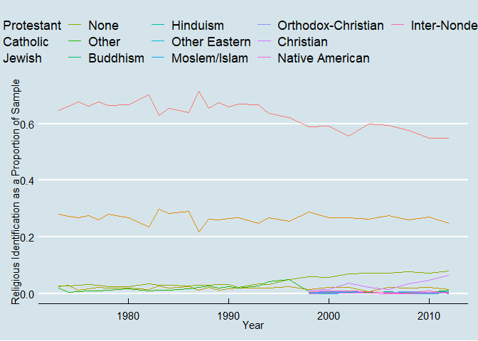<!-- -->

``` r
religion_year_change <- gss_eda_1_change %>% 
  group_by(year, relig) %>% 
  summarise(count = n()) %>% 
    mutate(freq = count / sum(count))
```

    ## `summarise()` regrouping output by 'year' (override with `.groups` argument)

``` r
ggplot(data = religion_year_change, aes(fill = relig, x = as.factor(year), y = freq)) +
  geom_bar(position = "stack",stat = "identity") + 
    xlab("Year") +
  ylab("Religious Identification as a Proportion of Sample") 
```

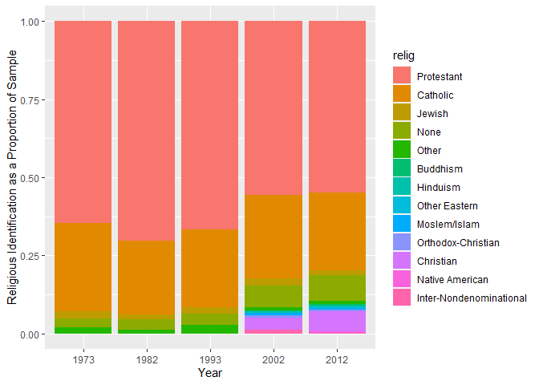<!-- -->

In Part 1 of Question 1, we find the proportion of people in the sample
belonging to a particular religion, we create a line graph to represent
a time series trend to show the the proportion of the sample belinging
to a particular religion and how the representation changed from 1973 to
2012. We find that representation of people who were protestant
decreased from around 63% to around 57%. Catholic representation
remained the same while some religions that weren’t a part of the sample
in 1973 were included in the sample and increased overtime. These
include Moslem, Orthodox Christian, Inter-nondenominational, Other and a
few others. We filtered our data and reduced our sample to religions
with at least 7 counts in order to make our visualization clearer. We
also created a stacked bar chart to show how change in religious
representation in year 1973,1982,2002 and 2012. We see that by 2002,
most likely due to trends in immigration, we’ve seen an increase in
other religions such as Orthodox Christianity, Moslem, Buddhism,
Hinduism etc. Therefore, we find that religious representation of other
religions has increased over the years most likely due to immigration.
We believe reduction in Protestants in the sample could be due to two
reasons, increase in other religions due to immigration and could also
be due to more people affiliating themselves with no religion which can
be seen in the chart as the people who are affiliated with no religion
has increased. THerefore, over the years the United States has become
more diverse in terms of religious representation and many people have
also become unaffiliated with religion which may show the prevalance of
Atheism.

#### (ii) How has attendance in religious services changed between 1973 to 2013. Create a bar plot for attendance in religious services in 1973 and another in 2013. What differences do you see?

``` r
attendance <- gss_eda_1_change %>% 
  mutate(attend = as.character(attend),
         attend = if_else(attend == 'Lt Once A Year', '<1/YR', attend),
         attend = as.factor(attend)) %>% 
  mutate(attend = as.character(attend),
         attend = if_else(attend == 'More Thn Once Wk', '>1/WK', attend),
         attend = as.factor(attend)) %>% 
  mutate(attend = as.character(attend),
         attend = if_else(attend == 'Every Week', '1/WK', attend),
         attend = as.factor(attend)) %>% 
  mutate(attend = as.character(attend),
         attend = if_else(attend == 'Nrly Every Week', '<1/WK', attend),
         attend = as.factor(attend)) %>% 
  mutate(attend = as.character(attend),
         attend = if_else(attend == 'Once A Year', '1/YR', attend),
         attend = as.factor(attend)) %>% 
    mutate(attend = as.character(attend),
         attend = if_else(attend == 'Sevrl Times A Yr', '>1/YR', attend),
         attend = as.factor(attend)) %>% 
    mutate(attend = as.character(attend),
         attend = if_else(attend == '2-3X A Month', '2-3/MTH', attend),
         attend = as.factor(attend)) %>% 
    mutate(attend = as.character(attend),
         attend = if_else(attend == 'Once A Month', '1/MTH', attend),
         attend = as.factor(attend))

attendance_1973 <- attendance %>% 
  filter(year == 1973) %>% 
  select(attend) %>% 
  group_by(attend) %>% 
  summarise(count = n()) %>% 
  mutate(proportion = count/sum(count)*100)
```

    ## `summarise()` ungrouping output (override with `.groups` argument)

``` r
summary(attendance_1973)
```

    ##      attend      count         proportion    
    ##  <1/WK  :1   Min.   : 91.0   Min.   : 7.321  
    ##  <1/YR  :1   1st Qu.:108.8   1st Qu.: 8.749  
    ##  >1/WK  :1   Median :117.5   Median : 9.453  
    ##  >1/YR  :1   Mean   :155.4   Mean   :12.500  
    ##  1/MTH  :1   3rd Qu.:193.8   3rd Qu.:15.587  
    ##  1/WK   :1   Max.   :297.0   Max.   :23.894  
    ##  (Other):2

``` r
ggplot(data = attendance_1973, aes(x = attend, y = proportion, fill = attend)) +
  geom_bar(stat = "identity") +
      xlab("Religion") +
  ylab("Percentage of Responses") +
 scale_fill_manual(values = c("red", "grey", "seagreen3","purple","darkgreen","skyblue","darkblue","orange")) +
    geom_text(aes(label = round(proportion, digits = 2)),size = 3, position = position_stack(vjust = 0.5))
```

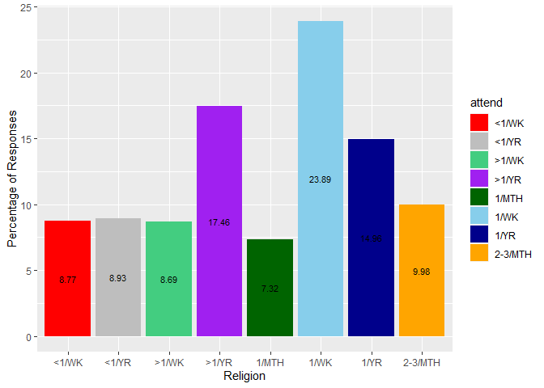<!-- -->

``` r
attendance_2012 <- attendance %>% 
  filter(year == 2012) %>% 
  select(attend) %>% 
  group_by(attend) %>% 
  summarise(count = n()) %>% 
  mutate(proportion = count/sum(count)*100)
```

    ## `summarise()` ungrouping output (override with `.groups` argument)

``` r
summary(attendance_2012)
```

    ##      attend      count         proportion    
    ##  <1/WK  :1   Min.   : 52.0   Min.   : 5.411  
    ##  <1/YR  :1   1st Qu.: 86.5   1st Qu.: 9.001  
    ##  >1/WK  :1   Median :107.5   Median :11.186  
    ##  >1/YR  :1   Mean   :120.1   Mean   :12.500  
    ##  1/MTH  :1   3rd Qu.:131.0   3rd Qu.:13.632  
    ##  1/WK   :1   Max.   :242.0   Max.   :25.182  
    ##  (Other):2

``` r
ggplot(data = attendance_2012, aes(x = attend, y = proportion, fill = attend)) +
  geom_bar(position = "stack",stat = "identity") +
        xlab("Religion") +
  ylab("Percentage of Responses")+
   scale_fill_manual(values = c("red", "grey", "seagreen3","purple","darkgreen","skyblue","darkblue","orange"))+
  geom_text(aes(label = round(proportion, digits = 2)),size = 3, position = position_stack(vjust = 0.5))
```

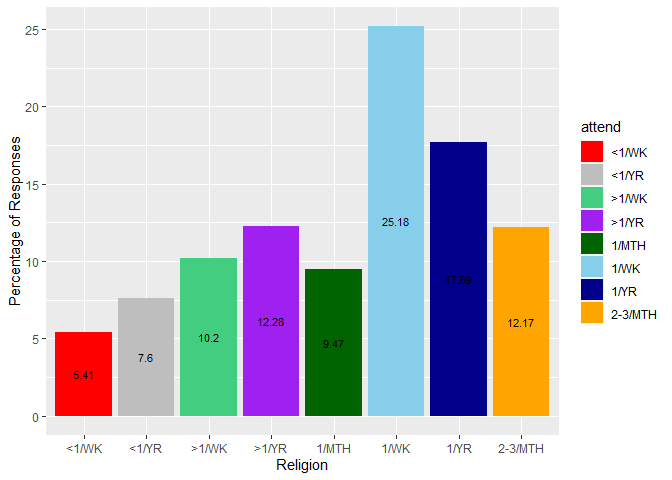<!-- -->

In this next step, we first reduce the length of characters in our
categories for religious attendance, the aim here is to reduce
characters in each category so the characters can fit well in our bar
chart. We compare religious attendance in 1973 and 2012. We create
charts for attendance in 1973,1982,2002, and 2012. We find that in 1973
that weekly religious attendance was the largest proportion with 23.9%
respondents attending religious services weekly, with the second largest
group being several times a year with around 17.5%, once a year bein
around 15% and lowest proportion being once a month 7.3% for Once a
month. In 2012, we find that weekly religious attendance has increased
to 25%, several times a year has decreased to 12% while one a year has
increased to 18% from 15%. More than once a week has increased from
8.69% to 10.2%. Therefore, we find that in some cases religious
attendance has increased with weekly or more than once a week attendance
percentages going up. On the other hand numbers for once a year has
increased by 3%. Attendance 2-3 times a month has only increased by 2%
while less than once a year has decrease by around 1-2%. Therefore we
find that in some cases attendance has increased while in other cases it
has decreased.

#### (iii) How has confidence in organized religion changed, show decade long change with a stacked bar chart.

``` r
confidence_in_orgreligion <- gss_eda_1 %>% 
  select(year, conclerg) %>%
  group_by(year,conclerg) %>% 
  summarise(count = n()) %>% 
  mutate(Proportion_of_Confidence = count/sum(count)) %>% 
  filter(year %in% c(1973,1982,2002,2012))
```

    ## `summarise()` regrouping output by 'year' (override with `.groups` argument)

``` r
ggplot(data = confidence_in_orgreligion, aes(fill = conclerg, x = as.factor(year), y = Proportion_of_Confidence)) +
  geom_bar(position = "stack",stat = "identity") +
        xlab("Year") +
  ylab("Proportion of Confidence in Organized Religion")+
  theme_economist() +
    geom_text(aes(label = round(Proportion_of_Confidence, digits = 2)),size = 3, position = position_stack(vjust = 0.5))
```

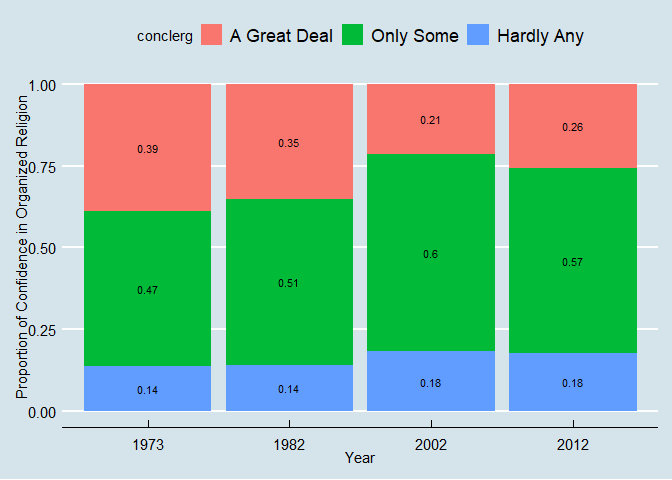<!-- -->

Now we analyze the figures for American confidence in organized
religion. We find that from 1973 to 2002, the trend has changed. In 1973
almost 40% of Americans had a great deal of confidence in organized
religion, while another 47 % had some confidence and 14% had hardly any
confidence in organized religion. By 2002 these figures had changed with
a large decrease in Americans who have a great deal in confidence in
organized religion from 39% to 21%, while only some confidence increase
by 13% to 60% and hardly any confidence increase 4% to 18%. By 2012,
there was a slight increase in proportion of Americans who had a great
of confidence in organized religion from 21% to 26%, and only some
decreased by 3% and hardly any remained unchanged. Overall from 1973 to
2012 there has been an overall decrease in a great deal of confidence in
organized religion while other categories have increased.

***Research Question 2:***

Second question deals with education levels, bachelor’s degree
attainment, sex, and confidence in education.

First let’s select our data for this question and let’s remove all NA
values to simplify our analysis,

``` r
gss_eda_2 <- gss_eda %>% 
  select(caseid, year, age, sex, race, educ, coneduc, degree)

gss_eda_2 <- gss_eda_2 %>% 
filter(!is.na(age), !is.na(sex), !is.na(race), !is.na(educ),!is.na(coneduc), !is.na(degree))
```

#### (i) For simplicity, reclassify the degree variable into those Americans with bachelor’s degree and those without a bachelor’s degree. How has bachelor’s degreee attainment changed in American from 1973 to 2012? Create a line graph and and a stacked bar chart to show this overtime change.

Let’s create a new variable which will be called bachelor\_or\_higher
which will be a binary variable where Yes counts individuals with higher
than a bachelor’s degree and No accounts for individuals with less than
a bachelor’s degree and let’s create a line plot showing the change in
this trend from 1973 to 2012.

``` r
usbachelor <- gss_eda_2 %>% 
  select(caseid, year, degree,sex,race) %>% 
  mutate(bachelor_or_higher = case_when(degree=="Lt High School" ~ "No Bachelor's",
                                        degree=="High School" ~ "No Bachelor's",
                                        degree=="Junior College" ~ "No Bachelor's",
                                        degree=="Bachelor" ~ "Bachelor's or More",
                                        degree=="Graduate" ~ "Bachelor's or More"))

usbachelor_1 <- usbachelor %>% 
  select(year, bachelor_or_higher) %>% 
  group_by(year, bachelor_or_higher) %>% 
  summarise(count = n()) %>% 
  mutate(percentage_with_bachelor = count/sum(count))
```

    ## `summarise()` regrouping output by 'year' (override with `.groups` argument)

``` r
ggplot(data = usbachelor_1, mapping = aes(x = year, y = percentage_with_bachelor, color = bachelor_or_higher)) +
  geom_line()+
    xlab("Year") +
  ylab("Percentage of People with Bachelor's Degree") +
   theme_economist()
```

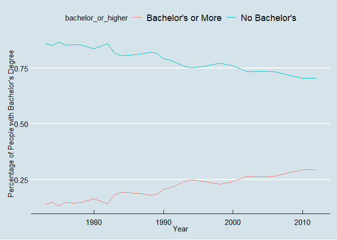<!-- -->

``` r
usbachelor_10yr <- usbachelor %>% 
  select(year, bachelor_or_higher) %>% 
    filter(year %in% c(1973,1982,1993,2000,2012)) %>% 
  group_by(year, bachelor_or_higher) %>% 
  summarise(count = n()) %>% 
  mutate(percentage_with_bachelor = count/sum(count)*100)
```

    ## `summarise()` regrouping output by 'year' (override with `.groups` argument)

``` r
usbachelor_10yr
```

    ## # A tibble: 10 x 4
    ## # Groups:   year [5]
    ##     year bachelor_or_higher count percentage_with_bachelor
    ##    <int> <chr>              <int>                    <dbl>
    ##  1  1973 Bachelor's or More   194                     13.7
    ##  2  1973 No Bachelor's       1219                     86.3
    ##  3  1982 Bachelor's or More   246                     14.1
    ##  4  1982 No Bachelor's       1504                     85.9
    ##  5  1993 Bachelor's or More   245                     24.1
    ##  6  1993 No Bachelor's        771                     75.9
    ##  7  2000 Bachelor's or More   440                     24.0
    ##  8  2000 No Bachelor's       1394                     76.0
    ##  9  2012 Bachelor's or More   388                     29.4
    ## 10  2012 No Bachelor's        930                     70.6

``` r
ggplot(data = usbachelor_10yr, mapping = aes(x = as.factor(year) , y = percentage_with_bachelor, fill = bachelor_or_higher)) +
  geom_bar(stat = "identity")+
    xlab("Year") +
  ylab("Percentage with Bachelor's Degree") +
   theme_economist() +
 geom_text(aes(label = round(percentage_with_bachelor, digits = 2)),size = 3, position = position_stack(vjust = 0.5)) 
```

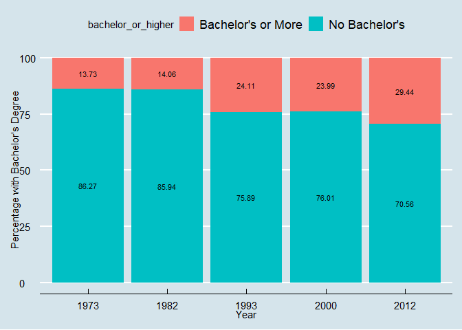<!-- -->

Both visualization show that percentage of Americans with bachelor’s
degree or higher has increased overtime. The line graph in 1973 starts
with a large gap with a very small portion of Americans with bachelor’s
degrees or higher, overtime however, we see a convergence between the
two lines No bachelor’s and bachelor’s or more. We find that overtime
that number of people who have a bachelors degree of higher increases
from somewhere around 10% to around 30% while the number of people with
lower than bachelor’s degree decreases from almost 90% in 1973 to 70% in
2012. The bar chart shows similar information but in 10 year intervels
as proportion of people with bachelor’s degree was relatively stagnant
from 1973 to 1982 with around 10% people with bachelor’s, then in 1993
we start to see the trend change as we see increase in bachelor’s or
more with almost 25% of the population having a degree. The figures
remain around the same till 2000, and we see another 5% increase in 2012
to 30%. It is likely that as technological advancements took place and
America shifted from manufacturing to services and technology, we see an
increase in bachelor’s degree.

#### (ii) Have the proportion of Americans with bachelor degrees changed? Has the gendar ratio for attainment of a bachelor’s degree changed from 1972 to 2012? Visualize this data. Have proportions of bachelor’s degree attainment changed by race? Visualize this data.

Now let’s find if these numbers have changed based on gender in between
1973 and 2012. Let’s first group and summarise our data based on year,
bachelor’s attainment and gender.

``` r
usbachelor_gender <- usbachelor %>% 
  select(year, bachelor_or_higher, sex) %>% 
     filter(year %in% c(1973,1982,1993,2000,2012)) %>% 
  group_by(year, bachelor_or_higher, sex) %>% 
  summarise(count = n()) %>% 
  ungroup(bachelor_or_higher) %>% 
  group_by(year, sex) %>% 
  mutate(percentage_with_bachelor = count/sum(count)*100)
```

    ## `summarise()` regrouping output by 'year', 'bachelor_or_higher' (override with `.groups` argument)

``` r
usbachelor_gender
```

    ## # A tibble: 20 x 5
    ## # Groups:   year, sex [10]
    ##     year bachelor_or_higher sex    count percentage_with_bachelor
    ##    <int> <chr>              <fct>  <int>                    <dbl>
    ##  1  1973 Bachelor's or More Male     112                     16.9
    ##  2  1973 Bachelor's or More Female    82                     10.9
    ##  3  1973 No Bachelor's      Male     549                     83.1
    ##  4  1973 No Bachelor's      Female   670                     89.1
    ##  5  1982 Bachelor's or More Male     118                     15.8
    ##  6  1982 Bachelor's or More Female   128                     12.8
    ##  7  1982 No Bachelor's      Male     629                     84.2
    ##  8  1982 No Bachelor's      Female   875                     87.2
    ##  9  1993 Bachelor's or More Male     117                     28.3
    ## 10  1993 Bachelor's or More Female   128                     21.3
    ## 11  1993 No Bachelor's      Male     297                     71.7
    ## 12  1993 No Bachelor's      Female   474                     78.7
    ## 13  2000 Bachelor's or More Male     223                     27.3
    ## 14  2000 Bachelor's or More Female   217                     21.4
    ## 15  2000 No Bachelor's      Male     595                     72.7
    ## 16  2000 No Bachelor's      Female   799                     78.6
    ## 17  2012 Bachelor's or More Male     182                     30.7
    ## 18  2012 Bachelor's or More Female   206                     28.4
    ## 19  2012 No Bachelor's      Male     410                     69.3
    ## 20  2012 No Bachelor's      Female   520                     71.6

``` r
ggplot(usbachelor_gender, aes(x = sex, y = percentage_with_bachelor))+
  geom_bar(
    aes(fill = bachelor_or_higher), stat = "identity", color = "white",
    position = position_dodge(0.9)
    )+
      xlab("Year") +
  ylab("Bachelor's Attainment Based on Sex")+
  facet_wrap(~year) 
```

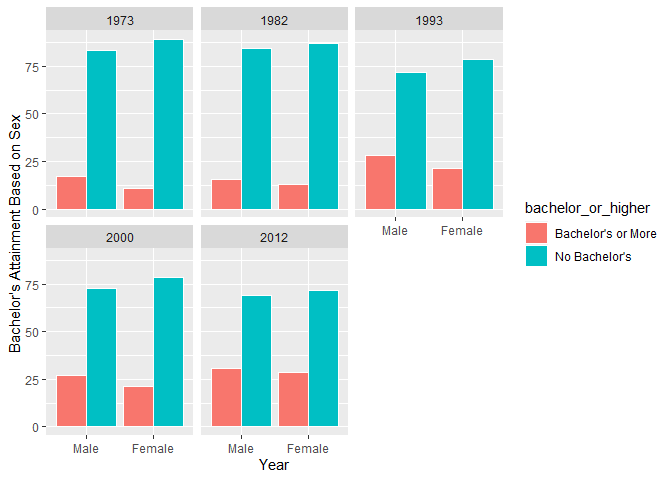<!-- -->

In this scenario we first summarize our data based on year, bachelor’s
degree and sex, and therefore we find the count of people with and
without bachelor’s degree or above and their sex. We then create a
percentage for the number of women as a fraction of the total number of
women with bachelor’s degrees or higher and we compute the same for
women. So the number of women with a without a bachelor’s degree add up
to 100. Now we create a bar plot for years 1973,1982,1993,2000 and 2012.
We found previously that the percentage of individuals with bachelor’s
degree or higher was very low around 10% in 1973 and increased overtime
to 30% in 2012. Here we find similar trends with the red bar showing
bachelor’s or more for both males and females and the blur bar showing
lower than bachelor’s for males and females. From 1973, we find that
both men and women with bachelor’s degree is very low, with women being
lower than men, with men being around 15% and women being around 10%.
Afterwards, we see an increase in 1982 for women to aroun 12% with men
being around the same. We see a drastic increase in 1993, similar to our
previous visualizations, We see a large increase for both men and women,
with men with bachelor’s degrees being around 28% of total men in the
sample and women increasing from 12 to around 20%. The numbers remain
around the same in 2002, however, by 2012 we see a slight increase for
men of around a few percentage points, while women increased to almost
around the same as men, probably a few percentage points lower.
Therefore, from 1973 to 2012 we’ve seen an increase for both men and
women, and ultimately gender parity when it comes to bachelor’s degree
or higher attainment, with men just having slightly higher attainment
than women.

Now let’s analyze bachelor’s degree attainment based on race.

``` r
usbachelor_race <- usbachelor %>% 
  select(year, bachelor_or_higher, race) %>% 
  filter(year %in% c(1973,1982,1993,2000,2012)) %>% 
  group_by(year, bachelor_or_higher, race) %>% 
  summarise(count = n()) %>% 
  ungroup(bachelor_or_higher) %>% 
  group_by(year,race) %>% 
  mutate(percentage_with_bachelor = count/sum(count)*100) 
```

    ## `summarise()` regrouping output by 'year', 'bachelor_or_higher' (override with `.groups` argument)

``` r
ggplot(usbachelor_race, aes(x = race, y = percentage_with_bachelor))+
  geom_bar(
    aes(fill = bachelor_or_higher), stat = "identity", color = "white",
    position = position_dodge(0.9)
    )+
      xlab("Year") +
  ylab("Bachelor's Attainment Based on Race")+
  facet_wrap(~year) 
```

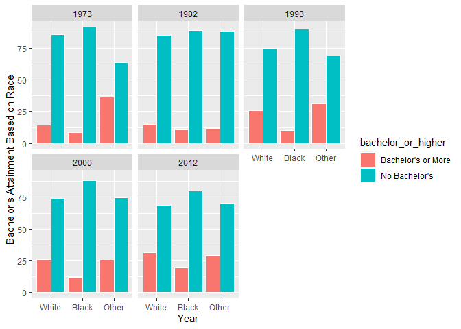<!-- -->

Now, let’s analyze how the bachelor’s degree attainment has changed
based on the race between 1973 and 2012. In this scenario we first
summarize our data based on year, bachelor’s degree or higher and race,
and therefore we find the count of people with and without bachelor’s
degree or above and their race. We then create a percentage for the
number of people with a bachelor’s degree or without a bachelor’r degree
based on their race. For example total percentage of white people with
bachelor’s degree or higher and total number of white people without a
bachelor’s degree add up to 100. Now we create a bar plot for years
1973,1982,1993,2000 and 2012. We are going to ignores figures for
“Other” race category in 1973. We found that there were less than 10
respondents for other category which can cause sampling errors so it
important to ignore these numbers from our sample. In 1973 we found that
around 14% of white respondents had a bachelor’s or higher and less than
9% of black respondents had a bachelor’s or higher. In 1982 we find that
number had only slightly increase for white respondents but increased
for black and other respondents to almost 12%. In 1993 we see numbers
increase for White and Other but actually reduce slightly for black
respondents. We see increase for white respondents from 12% to 25% and
for other from 11% to 31%.In 2000 we see little changes for any category
and actually a decrease for the other category from 31% to 25%. By 2012,
we see the the number of college degree or higher holding black
respondents increase drastically from 12% to 20%. We see a 5% increase
for White Americans from 26% to around 31% and a 4% increase for other
from 25% to 29%.

#### (iii) Is there a relationship between confidence in education and education levels. Explore both variables, visualize the relationship between these variables and also create a correlation matrix for years 1973, 2000 and 2012.

Lastly, we find out if there a relationship between confidence in
education and education levels. We do this by visualizing this data and
also calculating the correlation between these two variables.

``` r
useducation <- gss_eda_2 %>% 
  select(year, educ, coneduc)

useducation_1 <- useducation %>% 
  mutate(coneduc = as.character(coneduc),
         coneduc = if_else(coneduc == 'A Great Deal', '3', coneduc),
         coneduc = as.factor(coneduc)) %>% 
  mutate(coneduc = as.character(coneduc),
         coneduc = if_else(coneduc == 'Only Some', '2', coneduc),
         coneduc = as.factor(coneduc)) %>% 
  mutate(coneduc = as.character(coneduc),
         coneduc = if_else(coneduc == 'Hardly Any', '1', coneduc),
         coneduc = as.factor(coneduc))

useducation_1 <- useducation_1 %>% 
  select(year, educ, coneduc) %>% 
  group_by(year) %>% 
  summarise(mean_education = mean(educ), mean_coneduc = mean(as.numeric(coneduc)))
```

    ## `summarise()` ungrouping output (override with `.groups` argument)

``` r
ggplot(data = useducation_1, mapping = aes(x = year, y = mean_education, color = mean_education)) +
  geom_line()+
    xlab("Year") +
  ylab("Level of Education")
```

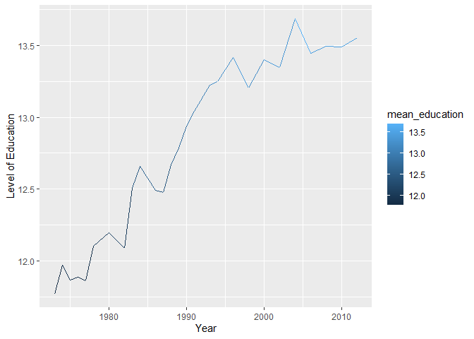<!-- -->

``` r
ggplot(data = useducation_1, mapping = aes(x = year, y = mean_coneduc, color = mean_coneduc)) +
  geom_line()+
    xlab("Year") +
  ylab("Level of Confidence in Education")
```

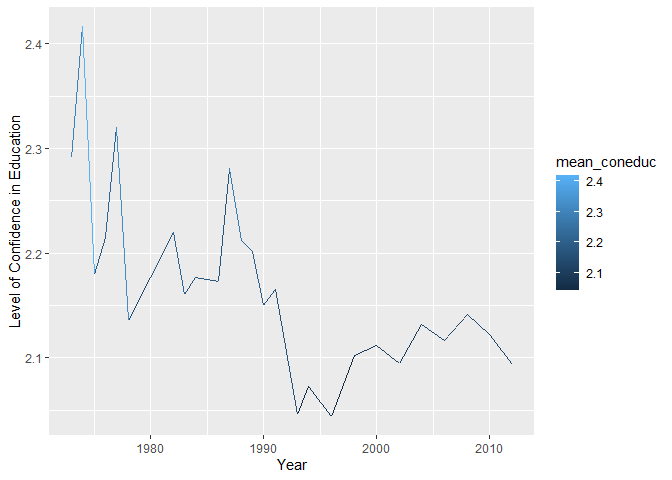<!-- -->

Firsly, we turn confidence in education into a numeric variable, coding
1 for individuals who choose “Hardly Any” confidence in education, 2 for
“Only Some” Confidence in Education and 3 for “A Great Deal” of
Confidence in Education. Afterwards we find mean education levels and
mean confidence in education from 1973 to 2012. We find that mean
education level has increased overtime from 11.8 to 13.6. From 1973, we
see volatility with increases and decreases, but overall increase till
1984, then we see a smooth increase from 1984 to 1996, after which we
see volatility between 1996 and 2004 but we see an overall increases, we
see a sharp decline from 2004 to 2006, after which we an overall
increase till 2012. We see that confidence in education has decreased
overtime from 2.3 in 1973 to around 2.09 in 2012. We see a lot of
volatility with sharp declines in the 1970s and 1980s after we see some
increases in the early 1990s till 2006, after which we see another sharp
decline till 2012. We do an improvement from the really low confidence
in education in 1993 of 2.05 to to 2.09 in 2012. By 2012, most Americans
have only a little greater than “Only Some” Confidence in Education
which was coded as 2 when we converted our factors to numeric variables.
Therefore, we see that overall education levels have increased from 11.8
to 13.6, we have seen confidence in education has decreased from 2.3 to
2.09, therefore, the two variables seem to be negatively correlated
overtime.

``` r
useducation_2 <- useducation %>%
  select(year, coneduc) %>% 
  group_by(year, coneduc) %>% 
  summarise(count = n()) %>% 
  mutate(percent_coneduc = count/sum(count)) %>% 
  filter(year %in% c(1973,1982,1993,2000,2012))
```

    ## `summarise()` regrouping output by 'year' (override with `.groups` argument)

``` r
ggplot(data = useducation_2, mapping = aes(x = factor(year) , y = percent_coneduc, fill = coneduc)) +
  geom_bar(stat = "identity")+
    xlab("Year") +
  ylab("Percentage of Confidence in Education") +
 geom_text(aes(label = round(percent_coneduc, digits = 2)),size = 3, position = position_stack(vjust = 0.5))
```

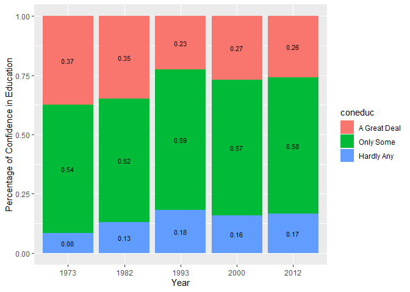<!-- -->

After finding the averages for education and confidence in education, we
want to analyze the data based on our categories, finding out how
Americans responded in all 3 categories of confidence in education. We
also want to see if there is a correlation between education level and
confidence in education across all 3 categories, meaning if response for
confidence in education differs by education level. Therefore, first we
create a bar plot comparing the percentage of respondents of the total
respondents that answered in each of the three categories for confidence
in education, “A Great Deal”, “Only Some” and “Hardly Any” confidence in
education. In 1973 we find that only 8% of Americans had “Hardly Any”
confidence in education, while 37% had “A Great Deal” of confidence in
education and more than half had “Only Some” confidence in education. We
find that over the next few decades confidence in education decreases,
as individuals who had “A Great Deal” of cofidence in education declines
to only 23% in 1993, and indivuduals with “Hardly Any” confidence in
education increases from 8% in 1973 to 18% in 1993 with almost 60%
Americans having “Only Some” confidence in education. By 2012, these
figures have changed only slightly as individuals with “A Great Deal” of
confidence in education have increased 3 percentage points to 26% and
individuals with “Hardly Any” confidence in education have decreased 1%
to 17% and “Only Some” has decreased a few percentage points to around
58%, remaining the majority of respondents choice between 1973 and 2012.
Therefore, overtime we have seen confidence in education decrease
overall, as we saw similarly with our mean in the line graph. We did,
however, see a slight trend upward between 1993 to 2012 but overall
decrease from 1973.

``` r
useducation_3 <- useducation %>% 
  mutate(coneduc = as.character(coneduc),
         coneduc = if_else(coneduc == 'A Great Deal', '3', coneduc),
         coneduc = as.factor(coneduc)) %>% 
  mutate(coneduc = as.character(coneduc),
         coneduc = if_else(coneduc == 'Only Some', '2', coneduc),
         coneduc = as.factor(coneduc)) %>% 
  mutate(coneduc = as.character(coneduc),
         coneduc = if_else(coneduc == 'Hardly Any', '1', coneduc),
         coneduc = as.factor(coneduc)) 


useducation_3_1 <- useducation_3  %>% 
  select(year, educ, coneduc) %>% 
  filter(year %in% c(1973,1982,1993,2000,2012)) %>% 
  group_by(year,coneduc) %>% 
  summarise(mean_education = mean(educ))
```

    ## `summarise()` regrouping output by 'year' (override with `.groups` argument)

``` r
ggplot(data = useducation_3_1, mapping = aes(x= coneduc, y = mean_education, fill = coneduc)) +
  geom_bar(stat = "identity")+
  facet_wrap(~year)+
    xlab("Year") +
  ylab("Level of Confidence in Education by Mean Education Levels") +
 geom_text(aes(label = round(mean_education, digits = 2)),size = 3, position = position_stack(vjust = 0.5))
```

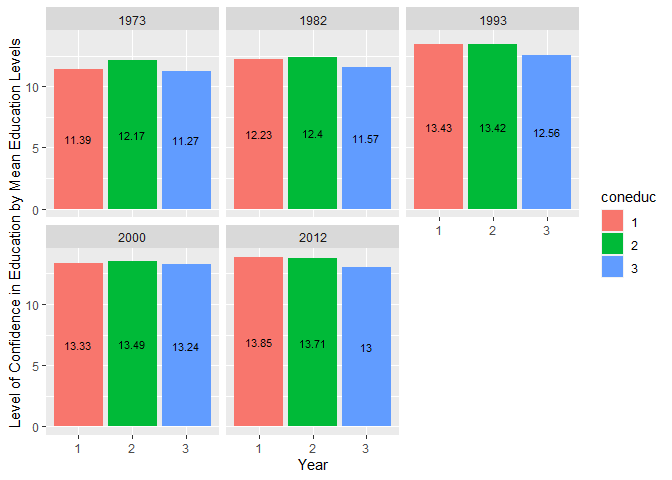<!-- -->

``` r
useducation_3_4 <- useducation_3 %>% 
  select(year, educ, coneduc) %>% 
  filter(year == 1973)

useducation_3_4$coneduc <- as.integer(useducation_3_4$coneduc)

useducation_cor_1973 <- cor.test(useducation_3_4$educ, useducation_3_4$coneduc, 
                    method = "pearson")

useducation_cor_1973 
```

    ## 
    ##  Pearson's product-moment correlation
    ## 
    ## data:  useducation_3_4$educ and useducation_3_4$coneduc
    ## t = -2.9571, df = 1411, p-value = 0.003157
    ## alternative hypothesis: true correlation is not equal to 0
    ## 95 percent confidence interval:
    ##  -0.1300963 -0.0264393
    ## sample estimates:
    ##         cor 
    ## -0.07847991

``` r
useducation_3_6 <- useducation_3 %>% 
  select(year, educ, coneduc) %>% 
  filter(year == 2000)

useducation_3_6$coneduc <- as.integer(useducation_3_6$coneduc)

useducation_cor_2000 <- cor.test(useducation_3_6$educ, useducation_3_6$coneduc, 
                    method = "pearson")

useducation_cor_2000
```

    ## 
    ##  Pearson's product-moment correlation
    ## 
    ## data:  useducation_3_6$educ and useducation_3_6$coneduc
    ## t = -0.71335, df = 1832, p-value = 0.4757
    ## alternative hypothesis: true correlation is not equal to 0
    ## 95 percent confidence interval:
    ##  -0.06238858  0.02913015
    ## sample estimates:
    ##         cor 
    ## -0.01666412

``` r
useducation_3_5 <- useducation_3 %>% 
  select(year, educ, coneduc) %>% 
  filter(year == 2012) 


useducation_3_5$coneduc <- as.integer(useducation_3_5$coneduc)

useducation_cor_2012 <- cor.test(useducation_3_5$educ, useducation_3_5$coneduc, 
                    method = "pearson")

useducation_cor_2012
```

    ## 
    ##  Pearson's product-moment correlation
    ## 
    ## data:  useducation_3_5$educ and useducation_3_5$coneduc
    ## t = -3.487, df = 1316, p-value = 0.0005046
    ## alternative hypothesis: true correlation is not equal to 0
    ## 95 percent confidence interval:
    ##  -0.14890751 -0.04190105
    ## sample estimates:
    ##        cor 
    ## -0.0956807

Now we analyze whether there is a relationship between education levels
and confidence in education. We create a barplot for the mean education
levels of the respondents for each category, “A Great Deal” coded for 3,
“Only Some” coded for 2, and “Hardly Any” coded for 1. We find the mean
education levels for each of the respondents in these categories for
years 1973, 1982, 1993, 2000 and 2012. We find that education levels for
each category have increased overtime from 1973 to 2012. We find that
mean education was between 11 to 12.2 for each category in 1993, by 2012
the mean education for each category was between 13 to almost 14. We
find that individuals that had “A Great Deal” of confidence in education
had the lowest level of education across 3 groups for each year, meaning
individuals with “A Great Deal” of confidence in education are less
education than other categories. However, by 2000 we find that mean
education for all categories has almost converged with individuals who
responded in each category having roughly around same education levels
between 13.2 and 13.4, we see slight divergence in 2012, with
individuals with the most mean education level of 13.85 having “Hardly
Any” confidence in education. Overall we find that in 1973 that those
with the lowest education level of 11.27 across these categories had “A
Great Deal” of confidence in education, while those with “Hardly Any’
Confidence in Education had mean education level of 11.39. By 2012, as
education levels increased, again those individuals who had”A Great
Deal" of confidence in education had a mean education level of 13, while
those who had a great deal of confidence in education.

Finally we calculate the pearson correlation coefficient for years 1973,
2000 and 2012 to show the relationship between education levels and
confidence in education. We find that in 1973 the coefficient was
-0.0784 which means that there is a negative relationship between
education level and confidence in education. Meaning a higher education
level would mean a lower confidence in education and this figure is
significant with a p-value less than 0,05. For year 2000 we find the
correlation coefficient to be -0.0166 which is less correlated than
1973, however, our p-value is 0.4757 which is very higher, much higher
than the 0.05 so this estimate may not be reliable and we can see that
the confidence intervel includes 0. However, in 2012 we see a large
coefficient of -0.096 which shows an even larger negative relationship
between education levels and confidence in education than 1973.
Therefore, as education levels increase, confidence in education
decreases. This estimate is significant with a p-value much lower than
0.05. Therefore we seem to see a negative correlation between education
levels and confidence in education, showing that more educated people
have less confidence in education. Our coefficient is below 0.1 for all
years so this correlation is not very strong but is significant at least
for years 1973 and 2012.

-----

## Part IV: Statistical Inference

In order to showcase skills in both hypothesis testing for mean,
hypothesis test for comparing two dependent mean, comparing more than
two means, hypthesis test for proportions, comparing two proportions,and
evaluate independence of two categorical variables with a chi-squared
test of independence. we will do one question for proportion testing,
one question for mean hypothesis testing and one question for group
testing.

***Research Question 1: ***

In this first research question, we will do analysis on education levels
in the US. We will compare education levels in the US to other
countries, find out whether education levels in the US differ by gender,
and lastly find out if education levels in the US differ by race.

### Part 1: Hypothesis Test of Means

1)  We find that the mean education in Australia in 1975 was 10.04 and
    the mean education for Canada in 1975 was 9.18.Conduct a hypothesis
    test for means, finding out if the mean education in the United
    States in 1973 is greater than the mean education in Australia,
    conduct simialr hypothesis test for US and Canada. Lastly find the
    confidence intervel for mean education level in the United States.

First let’s check our conditions.

``` r
gss_inference_1 <- gss_eda %>% 
  select(year, educ) %>% 
  filter(!is.na(educ)) %>% 
  filter(year %in% c(1973))

mean(gss_inference_1$educ)
```

    ## [1] 11.59706

``` r
hist(gss_inference_1$educ)
```

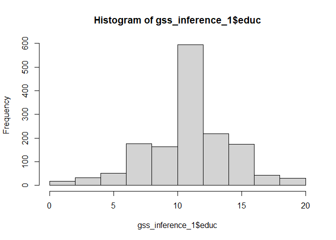<!-- -->

``` r
nrow(gss_inference_1)
```

    ## [1] 1499

We find that our point estimate is 11.59. For our conditions, we find
that n \> 30 and our histogram shows that our distribution is nearly
normal. We know from our data portion that is this the general social
survey and random sampling is used in this survey. Therefore, our
conditions are met. Now let’s conduct our hypothesis test.

``` r
gss_inference_1 <- gss_eda %>% 
  select(year, educ) %>% 
  filter(!is.na(educ)) %>% 
  filter(year %in% c(1973))

mean(gss_inference_1$educ)
```

    ## [1] 11.59706

``` r
# Test for Australia
inference(y = educ, data = gss_inference_1, statistic = "mean", type = "ht", null = 10.04, 
          alternative = "greater", method = "theoretical")
```

    ## Single numerical variable
    ## n = 1499, y-bar = 11.5971, s = 3.3287
    ## H0: mu = 10.04
    ## HA: mu > 10.04
    ## t = 18.1104, df = 1498
    ## p_value = < 0.0001

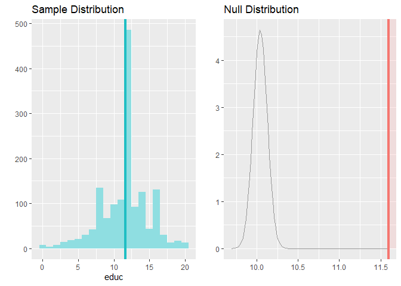<!-- -->

``` r
#Test for Canada
inference(y = educ, data = gss_inference_1, statistic = "mean", type = "ht", null = 9.18, 
          alternative = "greater", method = "theoretical")
```

    ## Single numerical variable
    ## n = 1499, y-bar = 11.5971, s = 3.3287
    ## H0: mu = 9.18
    ## HA: mu > 9.18
    ## t = 28.1131, df = 1498
    ## p_value = < 0.0001

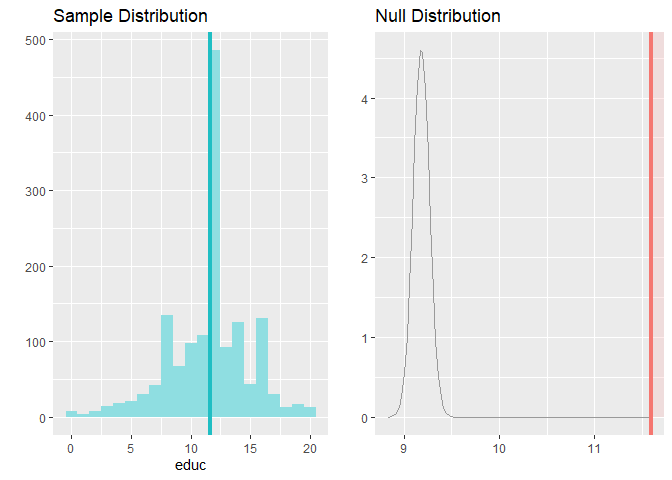<!-- -->

``` r
inference(y = educ, data = gss_inference_1, statistic = "mean", type = "ci", method = "theoretical")
```

    ## Single numerical variable
    ## n = 1499, y-bar = 11.5971, s = 3.3287
    ## 95% CI: (11.4284 , 11.7657)

<!-- -->

In both cases we find that the p-value is lower than 0,05 and therefore,
we reject the null hypothesis that the mean education level of US is
equal to that of Canada or Australia. We also find the confidence
intervel for mean education in the US. We are 95% confident that the
true mean education in the US is between 11.4284 and 11.7657.

### Part 2: Confidence Intervals for Two Means

(ii)Is there convincing evidence that the United States has seen a
change in its education levels from 1973 to 2012.

``` r
gss_inference_1_2 <- gss_eda %>% 
  select(year, educ) %>% 
  filter(!is.na(educ)) %>% 
  filter(year %in% c(2012))

hist(gss_inference_1$educ)
```

<!-- -->

``` r
hist(gss_inference_1_2$educ)
```

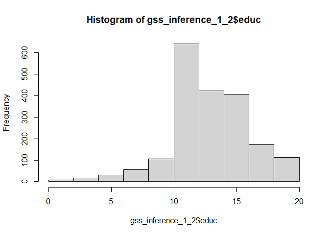<!-- -->

``` r
inference(y = educ ,data =  gss_inference_1, statistic = "mean", type = "ci", method = "theoretical", conf = 0.95)
```

    ## Single numerical variable
    ## n = 1499, y-bar = 11.5971, s = 3.3287
    ## 95% CI: (11.4284 , 11.7657)

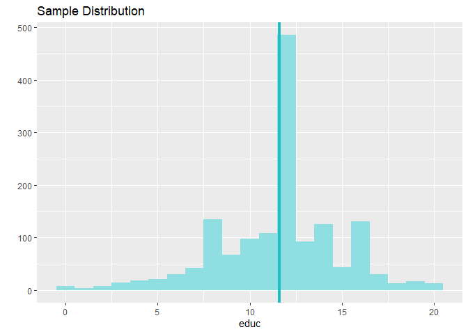<!-- -->

``` r
inference(y = educ,data =  gss_inference_1_2, statistic = "mean", type = "ci", method = "theoretical", conf = 0.95)
```

    ## Single numerical variable
    ## n = 1972, y-bar = 13.5279, s = 3.1266
    ## 95% CI: (13.3898 , 13.666)

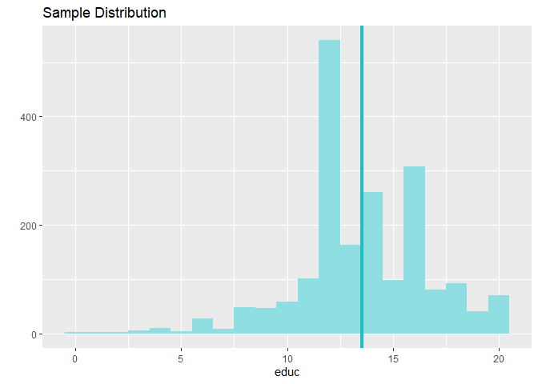<!-- -->

Since n\>30 and distribution is nearly normal for 1973. Distribution is
left skewed for 2012 but since we have a large sample, we believe our
distibution is nearly normal. We also know that sample is less than 10%
of the population. Since both our confidence intervels don’t overlap, we
find that the United States has seen a significant change in its
education levels. The 95% confidence intervals for education levels in
1973 is (11.4284 , 11.7657) and the 95% confidence intervals for
education levels in 2012 is (13.3898 , 13.666).

### Part 3: Hypothesis Test for Two Independent Means

3)  We would like to esimtate the difference between two independent
    means. Therefore, conduct a hypothesis test evaluating whether the
    education levels of male is different than the education level of
    female. Find inference for both 1973 and 2012.

<!-- end list -->

``` r
gss_inference_1_3_1 <- gss_eda %>% 
  select(year, educ, sex) %>% 
  filter(!is.na(educ), !is.na(sex)) %>% 
  filter(year %in% c(1973))

gss_inference_1_3_2 <- gss_eda %>% 
  select(year, educ, sex) %>% 
  filter(!is.na(educ), !is.na(sex)) %>% 
  filter(year %in% c(2012))

inference(y = educ, x = sex, data = gss_inference_1_3_1, statistic = "mean", type = "ht", method = "theoretical", null = 0, alternative = "twosided")
```

    ## Response variable: numerical
    ## Explanatory variable: categorical (2 levels) 
    ## n_Male = 699, y_bar_Male = 11.7153, s_Male = 3.7183
    ## n_Female = 800, y_bar_Female = 11.4938, s_Female = 2.945
    ## H0: mu_Male =  mu_Female
    ## HA: mu_Male != mu_Female
    ## t = 1.2661, df = 698
    ## p_value = 0.2059

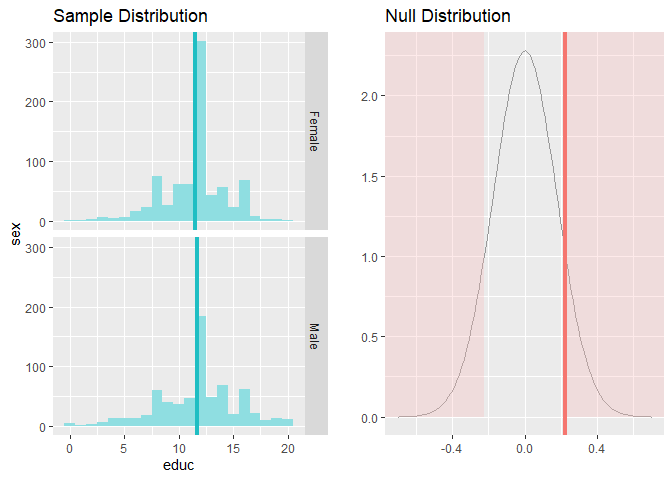<!-- -->

``` r
inference(y = educ, x = sex, data = gss_inference_1_3_2, statistic = "mean", type = "ht", method = "theoretical", null = 0, alternative = "twosided")
```

    ## Response variable: numerical
    ## Explanatory variable: categorical (2 levels) 
    ## n_Male = 884, y_bar_Male = 13.5057, s_Male = 3.1721
    ## n_Female = 1088, y_bar_Female = 13.546, s_Female = 3.0904
    ## H0: mu_Male =  mu_Female
    ## HA: mu_Male != mu_Female
    ## t = -0.2838, df = 883
    ## p_value = 0.7766

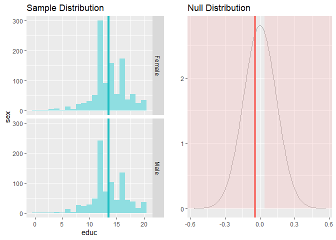<!-- -->

After conducting hypothesis test, we find that the p-value in both cases
is above 0.05. Therefore, we fail to reject the null hypothesis that
there is no significant difference in male and female education level in
both 1973 (p = 0.2059) and 2012 (p = 0.7766)

### Part 4: Analaysis of Variance: Education and Race

4)  Let’s conduct one more test comparing more than two means, in this
    case an ANOVA. Let’s find out whether education levels are different
    based on race. Let’s conduct this for both year 1973 and year 2012.

Our null hypothesis will be that the mean education level is same across
all 3 race categories while our alternative hypothesis is that atleast
one pair of means is different from each other. We will calculate the
F-Statistic in this case. In order to reject the null hypothesis we need
a small p-value (less than 0.05).

``` r
gss_inference_1_4_1 <- gss_eda %>% 
  select(year, educ, race) %>% 
  filter(!is.na(educ), !is.na(race)) %>% 
  filter(year %in% c(1973))

gss_inference_1_4_2 <- gss_eda %>% 
  select(year, educ, race) %>% 
  filter(!is.na(educ), !is.na(race)) %>% 
  filter(year %in% c(2012))

summary(gss_inference_1_4_1)
```

    ##       year           educ         race     
    ##  Min.   :1973   Min.   : 0.0   White:1303  
    ##  1st Qu.:1973   1st Qu.:10.0   Black: 183  
    ##  Median :1973   Median :12.0   Other:  13  
    ##  Mean   :1973   Mean   :11.6               
    ##  3rd Qu.:1973   3rd Qu.:13.0               
    ##  Max.   :1973   Max.   :20.0

``` r
summary(gss_inference_1_4_2)
```

    ##       year           educ          race     
    ##  Min.   :2012   Min.   : 0.00   White:1475  
    ##  1st Qu.:2012   1st Qu.:12.00   Black: 301  
    ##  Median :2012   Median :13.00   Other: 196  
    ##  Mean   :2012   Mean   :13.53               
    ##  3rd Qu.:2012   3rd Qu.:16.00               
    ##  Max.   :2012   Max.   :20.00

``` r
#filter our other in 1973
gss_inference_1_4_1 <- gss_inference_1_4_1 %>% 
  filter(race != "Other") 

gss_inference_1_4_1$race <- factor(gss_inference_1_4_1$race)
 
summary(gss_inference_1_4_1)
```

    ##       year           educ          race     
    ##  Min.   :1973   Min.   : 0.00   White:1303  
    ##  1st Qu.:1973   1st Qu.:10.00   Black: 183  
    ##  Median :1973   Median :12.00               
    ##  Mean   :1973   Mean   :11.59               
    ##  3rd Qu.:1973   3rd Qu.:13.00               
    ##  Max.   :1973   Max.   :20.00

``` r
ggplot(data = gss_inference_1_4_1, mapping = aes(y = educ, x = race, fill = race))+
  geom_boxplot()
```

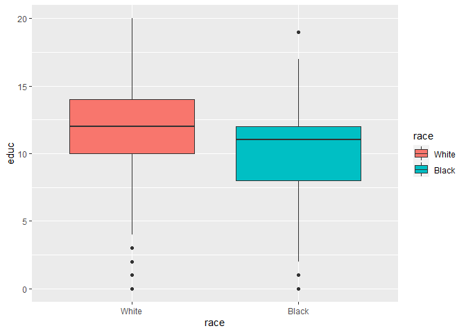<!-- -->

``` r
ggplot(data = gss_inference_1_4_2, mapping = aes(y = educ, x = race, fill = race))+
  geom_boxplot()
```

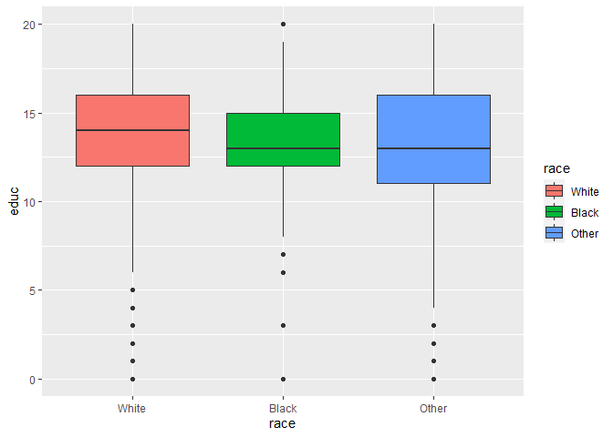<!-- -->

``` r
ggplot(data = gss_inference_1_4_1, mapping = aes(y = educ, fill = race))+
  geom_histogram()+
  facet_wrap(~race)
```

    ## `stat_bin()` using `bins = 30`. Pick better value with `binwidth`.

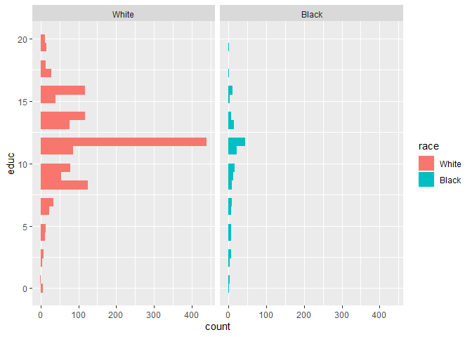<!-- -->

``` r
ggplot(data = gss_inference_1_4_2, mapping = aes(y = educ, fill = race))+
  geom_histogram()+
  facet_wrap(~race)
```

    ## `stat_bin()` using `bins = 30`. Pick better value with `binwidth`.

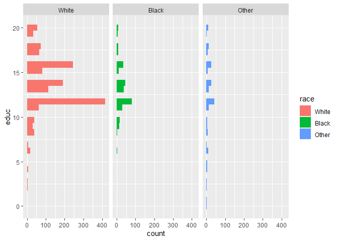<!-- -->

``` r
inference(y = educ, x = race, data = gss_inference_1_4_1, statistic = "mean", type = "ht", method = "theoretical", null = 0, alternative = "twosided")
```

    ## Response variable: numerical
    ## Explanatory variable: categorical (2 levels) 
    ## n_White = 1303, y_bar_White = 11.8081, s_White = 3.1891
    ## n_Black = 183, y_bar_Black = 10.071, s_Black = 3.7942
    ## H0: mu_White =  mu_Black
    ## HA: mu_White != mu_Black
    ## t = 5.9073, df = 182
    ## p_value = < 0.0001

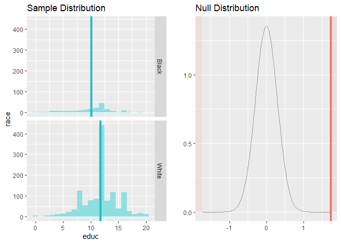<!-- -->

``` r
ANOVA_results_2012 <- aov(educ ~ race, data = gss_inference_1_4_2)

summary(ANOVA_results_2012)
```

    ##               Df Sum Sq Mean Sq F value   Pr(>F)    
    ## race           2    198   98.92   10.21 3.86e-05 ***
    ## Residuals   1969  19070    9.68                     
    ## ---
    ## Signif. codes:  0 '***' 0.001 '**' 0.01 '*' 0.05 '.' 0.1 ' ' 1

In order to meet the conditions of ANOVA. We must assume within group
and between group independence. Between group independence is met since
observations are independent as we took a random sample and we know that
sample of less than 10% of the population and we have sampled without
replacement and observations are non-paired. We see in our histogram
that distributions are left skewed, but since we have a large number of
observations we can assume approximate normality. Now we need to look at
the within group variability. We create boxplots and find that
variability is very high for “other” race in 1973 due to the number of
observations for other group being very low. Therefore, we should remove
observations in other group in 1973 since within group variability is
too high and only do a standard hypothesis test for inference for two
means and conduct an ANOVA for 2012 data.

For 1973, we conduct a hypothesis test and find a highly significant
p-value of less than 0,01. Therefore, we reject the null hypothesis and
have sufficient evidence that there is a significant difference between
education levels between white and black race categories. For 2012, we
find the F-statistic for year 2012. The first row which shows between
group variability since race is the category across which we are
comparing our means. The second row is within group variability, which
is also known as the error row. Our first row of explained sum of
squares which is the variability in the response variable explained by
variability in the analysis i.e. between group variability. The second
row of residuals is the Sum of Squares Errors (SSE) which measures the
within group variability i.e. the variability unexplained by the group
variability or due to other reasons. We divide our Sum of Squares with
our degrees of freedom and we get our mean squares, and we divide our
Mean Squared Group by Mean Squared Errors to get our F-Statistics which
is 10.21 for 2012. We use our F-Statistic to calculate our p value which
in this case is defined by the probability of an observed or more
extreme outcome given the null hypothesis is true. We find our p-value
is really low and therefore we reject the null hypothesis and that we
find convincing evidence that at least one pair of means of the race
group are different from each other. Now we conduct a pairwise
comparison.

Our ANOVA results show that at least one pairs of means is different but
we don’t know which one. Therefore, we conduct a pairwise comparison to
find out.

``` r
TukeyHSD(ANOVA_results_2012)
```

    ##   Tukey multiple comparisons of means
    ##     95% family-wise confidence level
    ## 
    ## Fit: aov(formula = educ ~ race, data = gss_inference_1_4_2)
    ## 
    ## $race
    ##                   diff       lwr         upr     p adj
    ## Black-White -0.5402601 -1.001920 -0.07860063 0.0168118
    ## Other-White -0.9326427 -1.487580 -0.37770560 0.0002467
    ## Other-Black -0.3923825 -1.062339  0.27757378 0.3549412

``` r
pairwise.t.test(gss_inference_1_4_2$educ, gss_inference_1_4_2$race, p.adjust.method = "BH")
```

    ## 
    ##  Pairwise comparisons using t tests with pooled SD 
    ## 
    ## data:  gss_inference_1_4_2$educ and gss_inference_1_4_2$race 
    ## 
    ##       White   Black  
    ## Black 0.00916 -      
    ## Other 0.00025 0.16969
    ## 
    ## P value adjustment method: BH

``` r
pairwise.t.test(gss_inference_1_4_2$educ, gss_inference_1_4_2$race, p.adjust.method = "bonf")
```

    ## 
    ##  Pairwise comparisons using t tests with pooled SD 
    ## 
    ## data:  gss_inference_1_4_2$educ and gss_inference_1_4_2$race 
    ## 
    ##       White   Black  
    ## Black 0.01833 -      
    ## Other 0.00025 0.50907
    ## 
    ## P value adjustment method: bonferroni

We conduct the Tukey pairwise comparison and find that all pairwise
differences except Other-Black are significant with a p-value lower than
0.05. We also do a pairwise t-test with the Benjamini-Hochberg method
and the more strict Bonferroni method and find that all groups are
significant except for Other-Black which seems to be the only
insignificant pairwise comparison. Therefore, we find that education
levels are much higher for people who identified as White compared to
other race categories. Therefore, there seems to be a correlation
between race and education levels.

***Research Question 2:***

In Question 2 we will conduct hypothesis test for proportions, estimate
the difference between two proportions, conduct a hypothesis test
comparing two sample proportions and and test the independence of two
categorical variables, with at least one of the variables having more
than one level.

### Part 1: Hypothesis Test for Proportion and Difference Between Two Proportions

1)  According to sources, 22.44% of Canadians and 30% Germans have
    bachelor’s degrees. Conduct a hypothesis test for proportions and
    find if the proportion of Americans with bachelor’s degrees is
    greater than Canadians and Germans in year 2012.

For Part 1 (i) let’s state both or null and alternative hypothesis.

1)  Null hypothesis is that American bachelor’s degree attainment is
    less than Canada
2)  Alternative hypothesis states that American bachelor’s degree is
    higher than Canada

<!-- end list -->

``` r
gss_inference_2_1_1 <- gss_eda %>% 
  select(year, degree)

gss_inference_2_1_1 <- gss_inference_2_1_1 %>% 
  select(year, degree) %>% 
  mutate(bachelor_or_higher = case_when(degree=="Lt High School" ~ "No Bachelor's",
                                        degree=="High School" ~ "No Bachelor's",
                                        degree=="Junior College" ~ "No Bachelor's",
                                        degree=="Bachelor" ~ "Bachelor's or More",
                                        degree=="Graduate" ~ "Bachelor's or More"))

gss_inference_2_1_1 <- gss_inference_2_1_1 %>% #remove NAs and filter out all years except 2012
  filter(!is.na(degree),!is.na(bachelor_or_higher)) %>% 
  filter(year == "2012") 

gss_inference_2_1_1$bachelor_or_higher <- as.factor(gss_inference_2_1_1$bachelor_or_higher)
summary(gss_inference_2_1_1) 
```

    ##       year                 degree             bachelor_or_higher
    ##  Min.   :2012   Lt High School:280   Bachelor's or More: 559    
    ##  1st Qu.:2012   High School   :976   No Bachelor's     :1407    
    ##  Median :2012   Junior College:151                              
    ##  Mean   :2012   Bachelor      :354                              
    ##  3rd Qu.:2012   Graduate      :205                              
    ##  Max.   :2012

``` r
gss_inference_2_1_1 %>% 
  select(bachelor_or_higher) %>% 
  group_by(bachelor_or_higher) %>% 
  summarise(count = n()) %>% 
  mutate(proportion = count/sum(count)*100)
```

    ## `summarise()` ungrouping output (override with `.groups` argument)

    ## # A tibble: 2 x 3
    ##   bachelor_or_higher count proportion
    ##   <fct>              <int>      <dbl>
    ## 1 Bachelor's or More   559       28.4
    ## 2 No Bachelor's       1407       71.6

Now that we’ve arranged our data in our preferred manner let’s see if
our data meets the condition for a hypothesis test of proportions. We
know this is survey data and some sort of random sampling method was
applied so observations are independent. We know that the proportions
for bachelor’s or more and no bachelor’s is 28.433% and 71.56%
respective. Let’s see if we meet the success/failure condition. The
condition is np\>10 and n(1-p)\>10 where p is success which in this case
is bachelor’s degree attainment.

``` r
559+1407
```

    ## [1] 1966

``` r
0.28*1966>10
```

    ## [1] TRUE

``` r
0.7156*1966>10
```

    ## [1] TRUE

Since both our results are greater than 10, we have met the success
failure condition. We will now conduct a hypothesis test.

``` r
#Canada
inference(y = bachelor_or_higher, data = gss_inference_2_1_1, statistic = "proportion", type = "ht", alternative = "greater", null = 0.224,  method = "theoretical", success = "Bachelor's or More")
```

    ## Single categorical variable, success: Bachelor's or More
    ## n = 1966, p-hat = 0.2843
    ## H0: p = 0.224
    ## HA: p > 0.224
    ## z = 5.9304
    ## p_value = < 0.0001

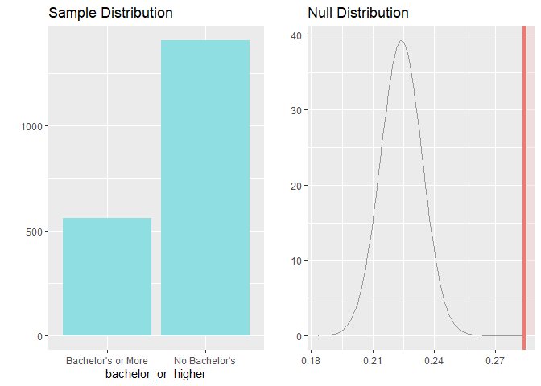<!-- -->

``` r
#Germany 
inference(y = bachelor_or_higher, data = gss_inference_2_1_1, statistic = "proportion", type = "ht", alternative = "greater", null = 0.30,  method = "theoretical", success = "Bachelor's or More")
```

    ## Single categorical variable, success: Bachelor's or More
    ## n = 1966, p-hat = 0.2843
    ## H0: p = 0.3
    ## HA: p > 0.3
    ## z = -1.5399
    ## p_value = 0.9382

<!-- -->

Therefore, we see our results for Canada and we reject the null
hypothesis and find there is convincing evidence that American
bachelor’s degree attainment is greater than Canada. In the case of
Germany, we fail to reject the null hypothesis and find that there is
convincing evidence that American bachelor’s degree attainment is not
greater than Germany.

### Part II

2)  Is there convincing evidence that United States has seen a change in
    its bachelor’s degree attainment levels between 2002 and 2012?

For (ii) we want to find out if America has seen a change in its
bachelor’s degree attainment levels from 2002 and 2012. Since we are
dealing with similar data we find that we have met all our conditions.
So we arrange our data and calculate our confidence intervals.

``` r
gss_inference_2_1_2 <- gss_eda %>% 
  select(year, degree)

gss_inference_2_1_2 <- gss_inference_2_1_2 %>% 
  select(year, degree) %>% 
  mutate(bachelor_or_higher = case_when(degree=="Lt High School" ~ "No Bachelor's",
                                        degree=="High School" ~ "No Bachelor's",
                                        degree=="Junior College" ~ "No Bachelor's",
                                        degree=="Bachelor" ~ "Bachelor's or More",
                                        degree=="Graduate" ~ "Bachelor's or More"))

gss_inference_2_1_2_1 <- gss_inference_2_1_2 %>% 
  filter(!is.na(degree),!is.na(bachelor_or_higher)) %>% 
  filter(year == "2002") %>% 
  select(year, bachelor_or_higher)

gss_inference_2_1_2_2 <- gss_inference_2_1_2 %>% 
  filter(!is.na(degree),!is.na(bachelor_or_higher)) %>% 
  filter(year == "2012") %>% 
  select(year, bachelor_or_higher)

inference(y = bachelor_or_higher, data = gss_inference_2_1_2_1, statistic = "proportion", type = "ci",  method = "theoretical", success = "Bachelor's or More")
```

    ## Single categorical variable, success: Bachelor's or More
    ## n = 2746, p-hat = 0.2451
    ## 95% CI: (0.229 , 0.2612)

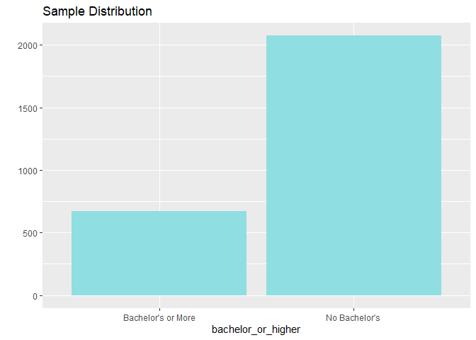<!-- -->

``` r
inference(y = bachelor_or_higher, data = gss_inference_2_1_2_2, statistic = "proportion", type = "ci",  method = "theoretical", success = "Bachelor's or More")
```

    ## Single categorical variable, success: Bachelor's or More
    ## n = 1966, p-hat = 0.2843
    ## 95% CI: (0.2644 , 0.3043)

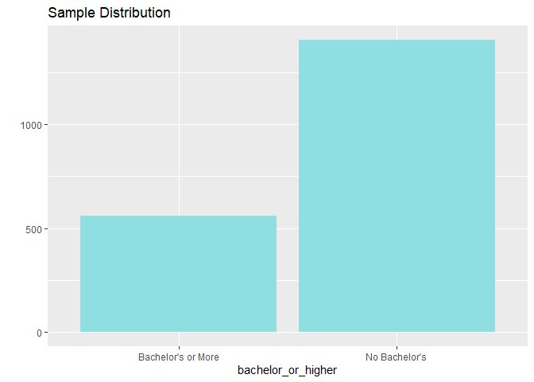<!-- -->

``` r
gss_inference_2_1_2_3 <- gss_inference_2_1_2 %>% 
  filter(!is.na(degree),!is.na(bachelor_or_higher)) %>% 
    filter(year %in% c(2002,2012)) %>% 
  select(year, bachelor_or_higher)

inference(y = bachelor_or_higher, x = year, data = gss_inference_2_1_2_3, null = 0, statistic = "proportion", type = "ht",  method = "theoretical", success = "Bachelor's or More", alternative = "twosided")
```

    ## Warning: Explanatory variable was numerical, it has been converted
    ##               to categorical. In order to avoid this warning, first convert
    ##               your explanatory variable to a categorical variable using the
    ##               as.factor() function

    ## Response variable: categorical (2 levels, success: Bachelor's or More)
    ## Explanatory variable: categorical (2 levels) 
    ## n_2002 = 2746, p_hat_2002 = 0.2451
    ## n_2012 = 1966, p_hat_2012 = 0.2843
    ## H0: p_2002 =  p_2012
    ## HA: p_2002 != p_2012
    ## z = -3.0233
    ## p_value = 0.0025

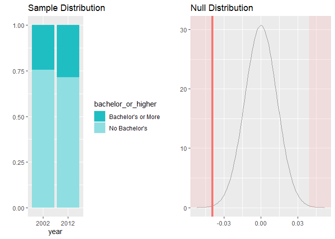<!-- -->

We calculate confidence intervals for years 2002 and 2012 and find that
these confidence intervels don’t overlap. Since they don’t overlap, we
have convincing evidence that the United States has indeed seen a
significant change in bachelor’s degree attainment from 2002 to 2012.
Confidence interval for 2002 is CI: (0.229 , 0.2612) and for 2012 is CI:
(0.2644 , 0.3043).

### Part III

3)  Conduct a hyppthesis test of two sample proportions and find if
    there is a relationship between bachelor’s degree attainment and
    party ID (for simplicity we will assume that there are only two
    parties: Democratic and Republican Party and delete all other
    observations). We will conduct a confidence intervel to estimate
    whether there is a difference between democrats with a bachelor’s
    degree and republican with a bachelor’s degree for years 1993 and
    2012

<!-- end list -->

``` r
gss_inference_2_1_3_1 <- gss_eda %>% 
  select(year, degree, partyid) %>% 
  filter(!is.na(year),!is.na(degree),!is.na(partyid))
summary(gss_inference_2_1_3_1$partyid)
```

    ##    Strong Democrat   Not Str Democrat       Ind,Near Dem        Independent 
    ##               8885              11801               6666               8327 
    ##       Ind,Near Rep Not Str Republican  Strong Republican        Other Party 
    ##               4869               8889               5477                840

``` r
gss_inference_2_1_3_1 <- gss_inference_2_1_3_1 %>% 
mutate(bachelor_or_higher = case_when(degree=="Lt High School" ~ "No Bachelor's",
                                        degree=="High School" ~ "No Bachelor's",
                                        degree=="Junior College" ~ "No Bachelor's",
                                        degree=="Bachelor" ~ "Bachelor's or More",
                                        degree=="Graduate" ~ "Bachelor's or More"))
gss_inference_2_1_3_1 <- gss_inference_2_1_3_1 %>% 
  mutate(partyid_2 = case_when(partyid=="Strong Democrat" ~ "Democrat",
                                        partyid=="Not Str Democrat" ~ "Democrat",
                                        partyid=="Ind,Near Dem" ~ "Democrat",
                                        partyid=="Ind,Near Rep" ~ "Republican",
                                        partyid=="Not Str Republican" ~ "Republican",
                                        partyid=="Strong Republican" ~ "Republican",
                                        partyid=="Independent"~ "NA", 
                                        partyid=="NA" ~ "NA",
                                        partyid=="Other Party" ~ "NA")) %>% 
  mutate(partyid_2 = as.factor(partyid_2))

gss_inference_2_1_3_1 <- gss_inference_2_1_3_1 %>% 
  filter(partyid_2!="NA") 

summary(gss_inference_2_1_3_1$partyid_2)
```

    ##   Democrat         NA Republican 
    ##      27352          0      19235

``` r
gss_inference_2_1_3_1$partyid_2 <- droplevels(gss_inference_2_1_3_1$partyid_2)

summary(gss_inference_2_1_3_1$partyid_2)
```

    ##   Democrat Republican 
    ##      27352      19235

``` r
gss_inference_2_1_3_2 <- gss_inference_2_1_3_1 %>% 
  filter(year == "1993")

gss_inference_2_1_3_3 <- gss_inference_2_1_3_1 %>% 
  filter(year == "2012")
```

For simplicity we’ll group all categories of democrats into one and all
categories of republicans into one and we’ll delete all independents.
Now that we’ve rearranged our data, let’s state our hypothesis. Our null
hypothesis states that there is no relationship between partyid and
bachelor’s degree meaning that proportion of democrats with a bachelor’s
degree is equal to proportion of republicans with bachelor’s degree. Our
alternative hypothesis states that there is a difference between
proportion of republican and proportion of democrats with bachelor’s
degrees. Now let’s check our conditions. We know that our survey data is
collected using some sort of random sampling, we know that our sample
without replacement is less than 10% of the population.

``` r
summary(gss_inference_2_1_3_2)
```

    ##       year                 degree                  partyid   
    ##  Min.   :1993   Lt High School:224   Not Str Democrat  :314  
    ##  1st Qu.:1993   High School   :702   Not Str Republican:298  
    ##  Median :1993   Junior College: 87   Strong Democrat   :223  
    ##  Mean   :1993   Bachelor      :234   Ind,Near Dem      :188  
    ##  3rd Qu.:1993   Graduate      :106   Strong Republican :175  
    ##  Max.   :1993                        Ind,Near Rep      :155  
    ##                                      (Other)           :  0  
    ##  bachelor_or_higher      partyid_2  
    ##  Length:1353        Democrat  :725  
    ##  Class :character   Republican:628  
    ##  Mode  :character                   
    ##                                     
    ##                                     
    ##                                     
    ## 

``` r
gss_inference_2_1_3_2 %>% 
  group_by(year, bachelor_or_higher, partyid_2) %>% 
  summarise(count = n()) %>% 
  ungroup() %>% 
  group_by(partyid_2) %>% 
  mutate(proportion = count/sum(count)*100)
```

    ## `summarise()` regrouping output by 'year', 'bachelor_or_higher' (override with `.groups` argument)

    ## # A tibble: 4 x 5
    ## # Groups:   partyid_2 [2]
    ##    year bachelor_or_higher partyid_2  count proportion
    ##   <int> <chr>              <fct>      <int>      <dbl>
    ## 1  1993 Bachelor's or More Democrat     155       21.4
    ## 2  1993 Bachelor's or More Republican   185       29.5
    ## 3  1993 No Bachelor's      Democrat     570       78.6
    ## 4  1993 No Bachelor's      Republican   443       70.5

``` r
#Bachelor's Degree Success Failure Condition
#Democrats
155+570
```

    ## [1] 725

``` r
0.21*725>10
```

    ## [1] TRUE

``` r
570*0.7862>10
```

    ## [1] TRUE

``` r
#Republicans 
443+185
```

    ## [1] 628

``` r
0.2945*628>10
```

    ## [1] TRUE

``` r
0.7054140*628>10
```

    ## [1] TRUE

``` r
gss_inference_2_1_3_3 %>% 
  group_by(year, bachelor_or_higher, partyid_2) %>% 
  summarise(count = n()) %>% 
    ungroup() %>% 
  group_by(partyid_2) %>% 
  mutate(proportion = count/sum(count)*100)
```

    ## `summarise()` regrouping output by 'year', 'bachelor_or_higher' (override with `.groups` argument)

    ## # A tibble: 4 x 5
    ## # Groups:   partyid_2 [2]
    ##    year bachelor_or_higher partyid_2  count proportion
    ##   <int> <chr>              <fct>      <int>      <dbl>
    ## 1  2012 Bachelor's or More Democrat     285       30.6
    ## 2  2012 Bachelor's or More Republican   189       31.6
    ## 3  2012 No Bachelor's      Democrat     647       69.4
    ## 4  2012 No Bachelor's      Republican   409       68.4

``` r
#Bachelor's Degree Suceess Failure Condition
#Democrats 
285+647
```

    ## [1] 932

``` r
0.3057*932>10
```

    ## [1] TRUE

``` r
0.6942*932>10
```

    ## [1] TRUE

``` r
#Republican
189+409
```

    ## [1] 598

``` r
0.31605*598>10
```

    ## [1] TRUE

``` r
0.6839*598>10
```

    ## [1] TRUE

``` r
inference(y = bachelor_or_higher, x = partyid_2, data = gss_inference_2_1_3_2, null = 0, statistic = "proportion", type = "ci",  method = "theoretical", success = "Bachelor's or More", alternative = "twosided")
```

    ## Response variable: categorical (2 levels, success: Bachelor's or More)
    ## Explanatory variable: categorical (2 levels) 
    ## n_Democrat = 725, p_hat_Democrat = 0.2138
    ## n_Republican = 628, p_hat_Republican = 0.2946
    ## 95% CI (Democrat - Republican): (-0.1273 , -0.0343)

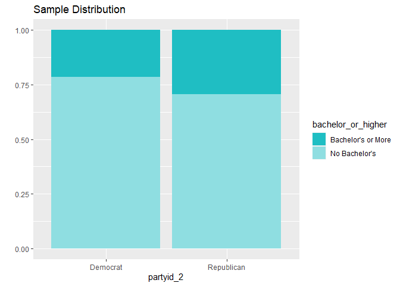<!-- -->

``` r
inference(y = bachelor_or_higher, x = partyid_2, data = gss_inference_2_1_3_2, null = 0, statistic = "proportion", type = "ht",  method = "theoretical", success = "Bachelor's or More", alternative = "twosided")
```

    ## Response variable: categorical (2 levels, success: Bachelor's or More)
    ## Explanatory variable: categorical (2 levels) 
    ## n_Democrat = 725, p_hat_Democrat = 0.2138
    ## n_Republican = 628, p_hat_Republican = 0.2946
    ## H0: p_Democrat =  p_Republican
    ## HA: p_Democrat != p_Republican
    ## z = -3.4169
    ## p_value = 6e-04

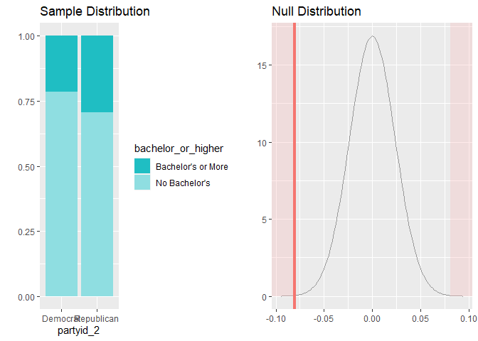<!-- -->

``` r
inference(y = bachelor_or_higher, x = partyid_2, data = gss_inference_2_1_3_3, null = 0, statistic = "proportion", type = "ci",  method = "theoretical", success = "Bachelor's or More", alternative = "twosided")
```

    ## Response variable: categorical (2 levels, success: Bachelor's or More)
    ## Explanatory variable: categorical (2 levels) 
    ## n_Democrat = 932, p_hat_Democrat = 0.3058
    ## n_Republican = 598, p_hat_Republican = 0.3161
    ## 95% CI (Democrat - Republican): (-0.0578 , 0.0373)

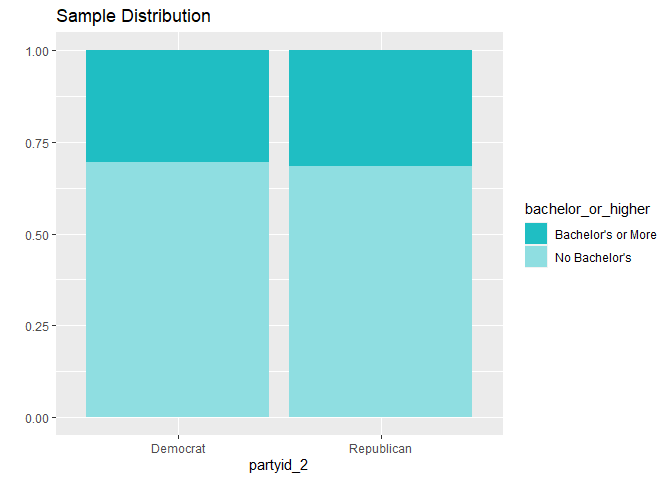<!-- -->

``` r
inference(y = bachelor_or_higher, x = partyid_2, data = gss_inference_2_1_3_3, null = 0, statistic = "proportion", type = "ht",  method = "theoretical", success = "Bachelor's or More", alternative = "twosided")
```

    ## Response variable: categorical (2 levels, success: Bachelor's or More)
    ## Explanatory variable: categorical (2 levels) 
    ## n_Democrat = 932, p_hat_Democrat = 0.3058
    ## n_Republican = 598, p_hat_Republican = 0.3161
    ## H0: p_Democrat =  p_Republican
    ## HA: p_Democrat != p_Republican
    ## z = -0.4235
    ## p_value = 0.672

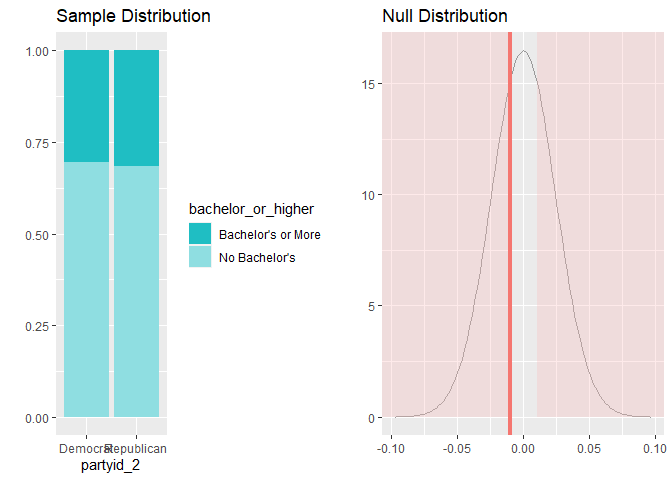<!-- -->

After estimating difference between two proportions we find that for
year 1993, the confidence intervals show that there is a significant
difference between bachelor’s degree attainment for democrats and
republicans. Our confidence intervals runs negative and we have a 95%
confidence interval of 95% CI (Democrat - Republican): (-0.1273 ,
-0.0343). Since our confidence intervals does not include 0, we find
that this negative difference is significant. We can verify that by
conducting a hypothesis test which is highly significant with a p-value
much lower than 0.05. Therefore, there is a significant difference
between bachelor’s degree attainment of republicans and democrats, as
attainment is higher for republicans, we reject the null hypothesis.

After estimating difference between two proportions we find that for
year 2012, the confidence intervals show that there is not a significant
difference between bachelor’s degree attainment for democrats and
republicans. We have a 95% confidence interval of 95% CI (Democrat -
Republican): (-0.0578 , 0.0373). Since our confidence intervals does
include 0, we find that this difference is insignificant. We can verify
that by conducting a hypothesis test which is highly insignificant with
a p-value greater than 0.05. Therefore, we fail to reject the null
hypothesis, there is not a significant difference in bachelor’s degree
attainment for democrats and republicans.

### Part 2: Chi-Square Test of Independence.

Conduct a chi-square test of independence to find out whether bachelor’s
degree has a relationship with racial identification, with racial
identification being white, black, other for years 1993 and 2012.

Our null hypothesis states that there is no relationship between
bachelor’s degree attainment and race, our alternative hypothesis states
that there is a relationship between bachelor’s degree attainment and
race.

Let’s first check our conditions. We know this survey uses random
sampling method and samples less than 10% of the population without
replacement.

``` r
gss_inference_2_2_1_1 <- gss_eda %>% 
  select(year, degree, race) %>% 
  filter(!is.na(degree),!is.na(race)) %>% 
   mutate(bachelor_or_higher = case_when(degree=="Lt High School" ~ "No Bachelor's",
                                        degree=="High School" ~ "No Bachelor's",
                                        degree=="Junior College" ~ "No Bachelor's",
                                        degree=="Bachelor" ~ "Bachelor's or More",
                                        degree=="Graduate" ~ "Bachelor's or More")) %>%   mutate(bachelor_or_higher = as.factor(bachelor_or_higher))

summary(gss_inference_2_2_1_1$bachelor_or_higher)
```

    ## Bachelor's or More      No Bachelor's 
    ##              11872              44179

``` r
gss_inference_2_2_1_2 <- gss_inference_2_2_1_1 %>% 
  filter(year == "2002")

gss_inference_2_2_1_3 <- gss_inference_2_2_1_1 %>% 
  filter(year == "2012")

gss_inference_2_2_1_2 %>% 
  select(bachelor_or_higher, race) %>% 
  group_by(bachelor_or_higher, race) %>% 
  summarise(count = n()) %>% 
  ungroup() %>%
  group_by(race) %>% 
  mutate(prop = count/sum(count)*100)
```

    ## `summarise()` regrouping output by 'bachelor_or_higher' (override with `.groups` argument)

    ## # A tibble: 6 x 4
    ## # Groups:   race [3]
    ##   bachelor_or_higher race  count  prop
    ##   <fct>              <fct> <int> <dbl>
    ## 1 Bachelor's or More White   587  27.0
    ## 2 Bachelor's or More Black    42  10.4
    ## 3 Bachelor's or More Other    44  26.8
    ## 4 No Bachelor's      White  1591  73.0
    ## 5 No Bachelor's      Black   362  89.6
    ## 6 No Bachelor's      Other   120  73.2

``` r
gss_inference_2_2_1_3 %>% 
  select(bachelor_or_higher, race) %>% 
  group_by(bachelor_or_higher, race) %>% 
  summarise(count = n()) %>% 
  ungroup() %>%
  group_by(race) %>% 
  mutate(prop = count/sum(count)*100)
```

    ## `summarise()` regrouping output by 'bachelor_or_higher' (override with `.groups` argument)

    ## # A tibble: 6 x 4
    ## # Groups:   race [3]
    ##   bachelor_or_higher race  count  prop
    ##   <fct>              <fct> <int> <dbl>
    ## 1 Bachelor's or More White   446  30.3
    ## 2 Bachelor's or More Black    60  20  
    ## 3 Bachelor's or More Other    53  27.2
    ## 4 No Bachelor's      White  1025  69.7
    ## 5 No Bachelor's      Black   240  80  
    ## 6 No Bachelor's      Other   142  72.8

Another condition is that each expected cell have at least 5 cases,
which is easily met. We also know that each case only contributes to one
cell in the table.

What is the bachelor’s degree attainment rate in the sample.

``` r
gss_inference_2_2_1_2 %>% 
  select(bachelor_or_higher) %>% 
  group_by(bachelor_or_higher) %>% 
  summarise(count = n()) %>% 
  mutate(prop = count/sum(count)*100)
```

    ## `summarise()` ungrouping output (override with `.groups` argument)

    ## # A tibble: 2 x 3
    ##   bachelor_or_higher count  prop
    ##   <fct>              <int> <dbl>
    ## 1 Bachelor's or More   673  24.5
    ## 2 No Bachelor's       2073  75.5

``` r
gss_inference_2_2_1_3 %>% 
  select(bachelor_or_higher) %>% 
  group_by(bachelor_or_higher) %>% 
  summarise(count = n()) %>% 
  mutate(prop = count/sum(count)*100)
```

    ## `summarise()` ungrouping output (override with `.groups` argument)

    ## # A tibble: 2 x 3
    ##   bachelor_or_higher count  prop
    ##   <fct>              <int> <dbl>
    ## 1 Bachelor's or More   559  28.4
    ## 2 No Bachelor's       1407  71.6

Attainment rate is 24.5% in 2002 and 28.4% in 2012. If the null
hypothesis is true the bachelor’s degree attainment rate should be the
same for all races: white,black and other. Let’s find our hypothesized
counts if the null hypothesis is true. Let’s do these calculations just
for 2002 as an example and assume a similar procedure for

``` r
#Total * average attainment rate

#White
446+1025
```

    ## [1] 1471

``` r
0.25*1471 #should be attainment for white if null is true
```

    ## [1] 367.75

``` r
#Black
60+240
```

    ## [1] 300

``` r
300*0.25 #Attainment for blacks if null true 
```

    ## [1] 75

``` r
#Other
53+142
```

    ## [1] 195

``` r
0.25*195 #Attainment for others if null true 
```

    ## [1] 48.75

Now let’s find our solution by using the chi-square test of
independence.

``` r
tbl = table(gss_inference_2_2_1_2$bachelor_or_higher, gss_inference_2_2_1_2$race)
tbl
```

    ##                     
    ##                      White Black Other
    ##   Bachelor's or More   587    42    44
    ##   No Bachelor's       1591   362   120

``` r
chisq_2002 <- chisq.test(tbl)
chisq_2002
```

    ## 
    ##  Pearson's Chi-squared test
    ## 
    ## data:  tbl
    ## X-squared = 50.991, df = 2, p-value = 8.463e-12

``` r
chisq_2002$residuals
```

    ##                     
    ##                           White      Black      Other
    ##   Bachelor's or More  2.3029646 -5.7297059  0.6003710
    ##   No Bachelor's      -1.3121852  3.2646769 -0.3420799

``` r
tbl_1 = table(gss_inference_2_2_1_3$bachelor_or_higher, gss_inference_2_2_1_3$race)
tbl_1
```

    ##                     
    ##                      White Black Other
    ##   Bachelor's or More   446    60    53
    ##   No Bachelor's       1025   240   142

``` r
chisq_2012 <- chisq.test(tbl_1)
chisq_2012
```

    ## 
    ##  Pearson's Chi-squared test
    ## 
    ## data:  tbl_1
    ## X-squared = 13.208, df = 2, p-value = 0.001355

``` r
chisq_2012$residuals
```

    ##                     
    ##                           White      Black      Other
    ##   Bachelor's or More  1.3566470 -2.7393498 -0.3283667
    ##   No Bachelor's      -0.8551174  1.7266581  0.2069751

In both cases. we have a high chi-square statistic and low p-value for
years 2002 and 2012. Therefore, we reject the null hypothesis, there is
convincing evidence that bachelor’s degree attainment is not independent
of race in both years. However, we do find that the residual differences
have decreased overtime from 2002 to 2012. And chi-sq value is much
higher for 2002 than 2012 and p-value is lower for 2002 than 2012.

``` r
library(corrplot)
```

    ## corrplot 0.84 loaded

``` r
corrplot(chisq_2002$residuals, is.cor = FALSE)
```

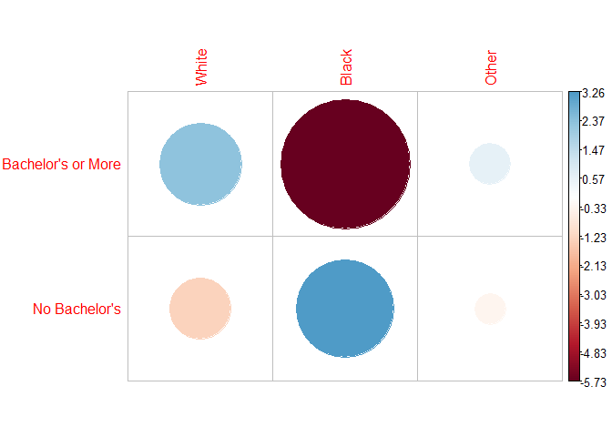<!-- -->

``` r
corrplot(chisq_2012$residuals, is.cor = FALSE)
```

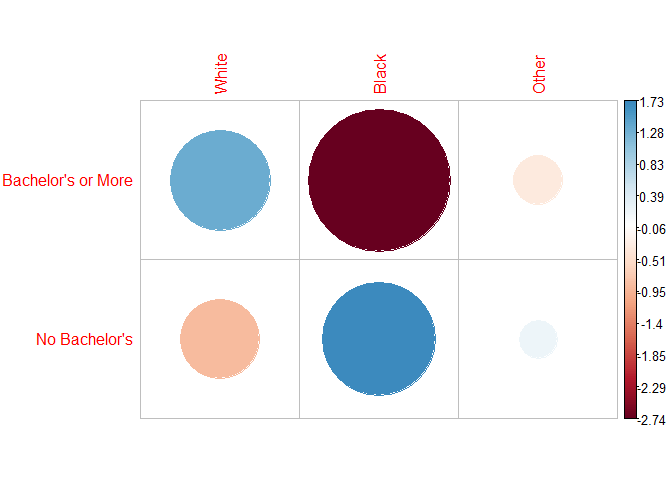<!-- -->

``` r
gss_inference_pairwise <- gss_inference_2_2_1_2 %>% 
  select(bachelor_or_higher, race)
```

We visualize our pearson residuals and we find that these residuals are
highest for black and white races while “other” race seems to have the
lowest residuals and therefore is closest to the average degree
attainment. Residuals are highest for individuals who identify as black,
then white, with lowest residuals being for individuals who identify as
other. The patterns are similar for both 2002 and 2012 with residuals
being higher 2002 than 2012.

## Conclusion

Therefore, we conducted analysis on GSS survey data and revealed a
number of insights on a number of years finding patterns overtime such
as religious identification change overtime, differences in religious
attendance in 1973 and 2012,10 year changes in confidence in religion
from 1973 to 2012, bachelor’s degree attainment overtime, confidence in
education overtime. We used a number of visualizetion and plots,
allowing us to do exploratory data analysis and allowing us to
hypothesize relationship between different variables. We conducted
inference on these variables such as comparing mean education levels in
US to other countries, finding confidence intervals for education levels
in years 1973 and 2012 to see change in education levels, conducting
inference to determine relationships between education and sex,
conducting an Analysis of Variance to determine relationship between
education level and race and conducting a pairwise comparison. We
conducted single proportion hypothesis tests comparing bachelor’s degree
attainment of US to other countries, conducting independent two sample
proportion hypothesis test to compare change in bachelor’s degree
attainment from 2002 to 2012, comparing two sample proportions
hypothesis to find if bachelor’s degree is different for democrats and
republicans, and lastly we conduct a chu-square test to find out whether
there a relationship between race and bachelor’s degree attainment.
Through Exploratory Data Analysis and Inference, I have answered several
questions and established relationship between a number of variables in
the survey. Whether correlation is causation, we will find out through
regression analysis.
